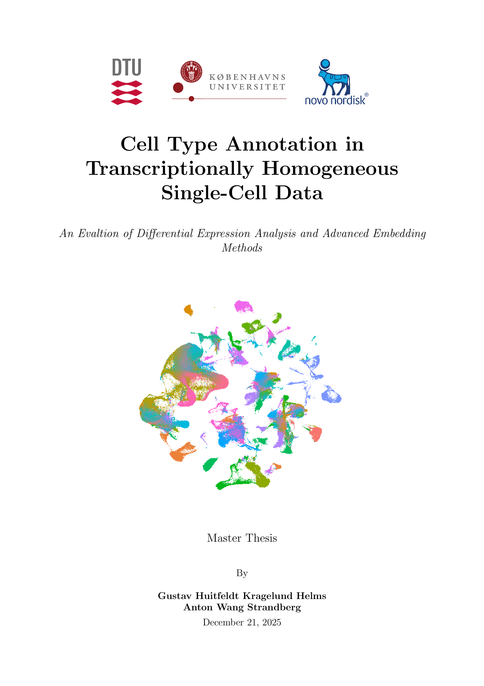

This is the code used for the Master's thesis "Cell Type Annotation in Transcriptionally Homogeneous Single-Cell Data: An Evaluation of Differential Expression Analysis and Advanced Embedding Methods" by Anton Wang and Gustav Helms (2025). The Thesis was supervised by Ole Winther (University of Copenhagen) and Alexander Valentin (Novo Nordisk). 

### Cell Type Annotation in Transcriptionally Homogeneous Single-Cell Data
#### An Evaltion of Differential Expression Analysis and Advanced Embedding Methods

